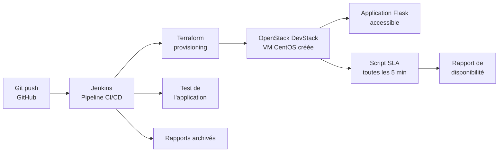
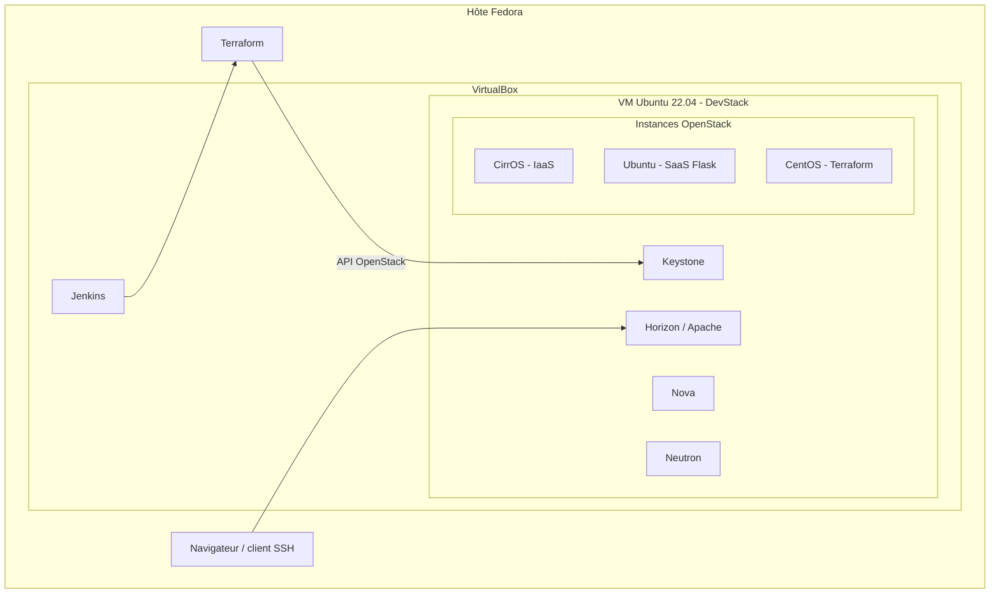

# Cloud & Edge Computing — Cloud privé OpenStack automatisé


**Contrainte du projet** : toutes les installations sont réalisées **localement** (VirtualBox / VM locales). Aucun cloud externe (AWS, Azure, GCP...) n'est utilisé.

---

## Sommaire

1. [Présentation](#1-présentation)
2. [Architecture](#2-architecture)
3. [Structure du dépôt](#3-structure-du-dépôt)
4. [Prérequis](#4-prérequis)
5. [Partie 1 — OpenStack (DevStack)](#5-partie-1--openstack-devstack)
6. [Partie 2 — Terraform](#6-partie-2--terraform-infrastructure-as-code)
7. [Partie 3 — SLA et supervision](#7-partie-3--sla-et-supervision)
8. [Partie 4 — Jenkins CI/CD](#8-partie-4--jenkins-cicd-ajout-personnel)
9. [Difficultés rencontrées et solutions](#9-difficultés-rencontrées-et-solutions)
10. [Résultats et compétences démontrées](#10-résultats-et-compétences-démontrées)
11. [Améliorations possibles](#11-améliorations-possibles)

---

## 1. Présentation

Ce projet met en place un **cloud privé IaaS** avec OpenStack (DevStack), puis y ajoute une chaîne d'automatisation complète :

| # | Bloc | Origine | Rôle |
|---|------|---------|------|
| 1 | **OpenStack (DevStack)** | Cahier des charges | Cloud privé : Nova, Neutron, Keystone, Horizon |
| 2 | **Terraform** | Cahier des charges | Provisionnement automatique d'une VM CentOS (IaC) |
| 3 | **SLA & supervision** | Cahier des charges | Disponibilité >= 99,5 % / jour, script Python toutes les 5 min |
| 4 | **Jenkins** | Ajout personnel | Pipeline CI/CD : Git, Terraform, test, rapport |

---

## 2. Architecture

### Flux d'automatisation



### Infrastructure



| Couche | Outil | Rôle |
|---|---|---|
| Virtualisation | VirtualBox + OpenStack (DevStack) | Hyperviseur et cloud privé local |
| IaC | Terraform | Provisionnement automatique des VMs |
| CI/CD | Jenkins | Pipeline automatisé |
| Supervision | Python + `sla.json` + cron | Surveillance continue et rapport SLA |

---

## 3. Structure du dépôt

```
cloud-edge-project/
├── README.md
├── terraform/
│   └── main.tf                # VM CentOS sur OpenStack
├── app/
│   ├── app.py                 # Application Flask (SaaS)
│   └── requirements.txt
├── monitoring/
│   ├── sla.json               # Contrat SLA + derniers résultats
│   └── sla_monitor.py         # Script de surveillance
├── jenkins/
│   └── Jenkinsfile            # Pipeline déclaratif
└── rapport/
    └── rapport_final.pdf
```

---

## 4. Prérequis

**Machine hôte (Fedora)**
- Virtualisation activée (VT-x / AMD-V) — vérification : `egrep -c '(vmx|svm)' /proc/cpuinfo`
- 16 Go de RAM recommandés (8 Go minimum)
- VirtualBox, Git, client SSH (`ssh`), Terraform

```bash
# VirtualBox via RPM Fusion
sudo dnf install -y kernel-devel kernel-headers gcc make perl dkms elfutils-libelf-devel
sudo dnf install -y https://download1.rpmfusion.org/free/fedora/rpmfusion-free-release-$(rpm -E %fedora).noarch.rpm
sudo dnf install -y akmod-VirtualBox binutils patch
sudo akmods --force && sudo systemctl restart vboxdrv
sudo usermod -aG vboxusers $USER

# Terraform (dépôt HashiCorp)
sudo dnf install -y dnf-plugins-core
sudo dnf config-manager addrepo --from-repofile=https://rpm.releases.hashicorp.com/fedora/hashicorp.repo
sudo dnf install -y terraform
terraform -version
```

> Si Secure Boot est actif, le module `vboxdrv` doit être signé (MOK) ou Secure Boot désactivé.

**VM DevStack** : Ubuntu 22.04 LTS · >= 4 vCPU · >= 8 Go RAM · 60 Go disque · réseau Bridge ou Host-only + NAT.

---

## 5. Partie 1 — OpenStack (DevStack)

### 1.1 Installation de DevStack

```bash
# Dans la VM Ubuntu
sudo useradd -s /bin/bash -d /opt/stack -m stack
sudo chmod +x /opt/stack
echo "stack ALL=(ALL) NOPASSWD: ALL" | sudo tee /etc/sudoers.d/stack
sudo -u stack -i

git clone https://opendev.org/openstack/devstack
cd devstack
```

`local.conf` minimal :

```ini
[[local|localrc]]
ADMIN_PASSWORD=<mot_de_passe>
DATABASE_PASSWORD=$ADMIN_PASSWORD
RABBIT_PASSWORD=$ADMIN_PASSWORD
SERVICE_PASSWORD=$ADMIN_PASSWORD
HOST_IP=<IP_DE_LA_VM>
```

```bash
./stack.sh        # 30 à 60 minutes
```

À la fin, DevStack affiche les URLs (Horizon, Keystone) et les identifiants.

### 1.2 Test des services

- **Horizon** : `http://<IP_VM>/dashboard` (utilisateur `admin`)
- **Nova** : liste des instances / création d'une instance de test
- **Neutron** : réseaux `public`, `private`, routeur
- Vérification : démarrage, arrêt, `ping`, SSH

```bash
source ~/devstack/openrc admin admin
openstack service list
openstack server list
openstack network list
```

### 1.3 IaaS — VM CirrOS

```bash
# Sur l'hôte Fedora
ssh-keygen -t ed25519 -f ~/.ssh/openstack_key

# Dans OpenStack
openstack keypair create --public-key ~/.ssh/openstack_key.pub my-keypair
openstack security group rule create --proto icmp default
openstack security group rule create --proto tcp --dst-port 22 default
openstack server create --image cirros-0.6.2-x86_64-disk \
  --flavor m1.tiny --key-name my-keypair --network private cirros-vm
openstack floating ip create public
openstack server add floating ip cirros-vm <IP_FLOTTANTE>

ssh -i ~/.ssh/openstack_key cirros@<IP_FLOTTANTE>
```

Commandes de validation : `uname -a`, `whoami`, `df -h`, `free -m`, `ip a`.

### 1.4 SaaS — Application Flask

`app/app.py` :

```python
from flask import Flask, jsonify
import socket, datetime

app = Flask(__name__)

@app.route("/")
def index():
    return (
        "<h1>Cloud & Edge Computing</h1>"
        f"<p>Application Flask déployée sur OpenStack.</p>"
        f"<p>Hôte : {socket.gethostname()}</p>"
        f"<p>Heure : {datetime.datetime.now():%Y-%m-%d %H:%M:%S}</p>"
    )

@app.route("/health")
def health():
    return jsonify(status="ok")

if __name__ == "__main__":
    app.run(host="0.0.0.0", port=5000)
```

`app/requirements.txt` : `flask`

Déploiement manuel sur une VM Ubuntu (gabarit `m1.small`) :

```bash
sudo apt update && sudo apt install -y python3 python3-venv
mkdir -p ~/webapp && cd ~/webapp
python3 -m venv venv && source venv/bin/activate
pip install -r requirements.txt
python app.py
```

Accès depuis l'hôte : `http://<IP_VM>:5000` (autoriser le port 5000 dans le groupe de sécurité).

---

## 6. Partie 2 — Terraform (Infrastructure as Code)

`terraform/main.tf` :

```hcl
terraform {
  required_providers {
    openstack = {
      source  = "terraform-provider-openstack/openstack"
      version = "~> 1.51.0"
    }
  }
}

variable "auth_url"    { default = "http://<IP_VM_DEVSTACK>/identity" }
variable "password"    { sensitive = true }
variable "image_name"  { default = "CentOS-7" }
variable "flavor_name" { default = "m1.small" }
variable "key_pair"    { default = "my-keypair" }

provider "openstack" {
  auth_url    = var.auth_url
  user_name   = "admin"
  password    = var.password
  tenant_name = "admin"
  region      = "RegionOne"
}

resource "openstack_compute_instance_v2" "centos_vm" {
  name            = "centos-terraform"
  image_name      = var.image_name
  flavor_name     = var.flavor_name
  key_pair        = var.key_pair
  security_groups = ["default"]

  network {
    name = "private"
  }
}

output "vm_ip" {
  value = openstack_compute_instance_v2.centos_vm.access_ip_v4
}
```

Exécution :

```bash
cd terraform
export TF_VAR_password='<mot_de_passe_admin>'   # jamais dans Git
terraform init
terraform plan
terraform apply
terraform show
openstack server list      # vérification côté OpenStack
```

> Le mot de passe n'est jamais écrit en clair dans le dépôt : il est passé par variable d'environnement (`TF_VAR_password`) ou par les credentials Jenkins.

---

## 7. Partie 3 — SLA et supervision

### 3.1 Fichier SLA — `monitoring/sla.json`

```json
{
  "sla_name": "OpenStack-SLA-Daily",
  "version": "1.0",
  "evaluation_period": "daily",
  "availability_target": 99.5,
  "monitoring_interval_minutes": 5,
  "services": ["nova", "neutron", "keystone"],
  "metrics": ["instance_state", "availability", "service_health"],
  "alert_on_violation": true,
  "last_check": null,
  "report": {}
}
```

### 3.2 Script de surveillance — `monitoring/sla_monitor.py`

Le script interroge **Keystone** (authentification), **Nova** (instances) et **Neutron** (réseaux) via `openstacksdk`, calcule le taux de disponibilité, met à jour `sla.json` et indique si l'objectif de 99,5 % est respecté.

```python
#!/usr/bin/env python3
"""Surveillance SLA OpenStack — exécutée toutes les 5 minutes."""
import json
import os
from datetime import datetime, timezone
from pathlib import Path

import openstack

BASE = Path(__file__).resolve().parent
SLA_FILE = BASE / "sla.json"
HISTORY_FILE = BASE / "history.json"


def load(path, default):
    try:
        return json.loads(path.read_text())
    except (FileNotFoundError, json.JSONDecodeError):
        return default


def check_services(conn):
    """Vérifie que Keystone, Nova et Neutron répondent."""
    status = {}
    try:
        conn.authorize()
        status["keystone"] = "up"
    except Exception:
        status["keystone"] = "down"
    try:
        list(conn.compute.flavors())
        status["nova"] = "up"
    except Exception:
        status["nova"] = "down"
    try:
        list(conn.network.networks())
        status["neutron"] = "up"
    except Exception:
        status["neutron"] = "down"
    return status


def check_instances(conn):
    servers = list(conn.compute.servers())
    total = len(servers)
    active = sum(1 for s in servers if s.status == "ACTIVE")
    return total, active, {s.name: s.status for s in servers}


def main():
    sla = load(SLA_FILE, {})
    history = load(HISTORY_FILE, [])
    target = sla.get("availability_target", 99.5)
    now = datetime.now(timezone.utc)

    try:
        conn = openstack.connect()  # lit les variables OS_* (openrc)
        services = check_services(conn)
        total, active, states = check_instances(conn)
        availability = 100.0 if total == 0 else active / total * 100
        if "down" in services.values():
            availability = 0.0
    except Exception as exc:
        services = {"keystone": "down", "nova": "down", "neutron": "down"}
        total, active, states = 0, 0, {}
        availability = 0.0
        print(f"[ERREUR] connexion OpenStack impossible : {exc}")

    history.append({
        "timestamp": now.isoformat(),
        "availability": round(availability, 2),
        "instances_total": total,
        "instances_active": active,
        "services": services,
    })
    HISTORY_FILE.write_text(json.dumps(history, indent=2))

    # Disponibilité journalière = moyenne des contrôles du jour
    today = now.date().isoformat()
    today_checks = [h["availability"] for h in history
                    if h["timestamp"].startswith(today)]
    daily = round(sum(today_checks) / len(today_checks), 2)
    respected = daily >= target

    sla["last_check"] = now.isoformat()
    sla["report"] = {
        "date": today,
        "checks_today": len(today_checks),
        "last_availability": round(availability, 2),
        "daily_availability": daily,
        "target": target,
        "sla_respected": respected,
        "verdict": "OBJECTIF RESPECTÉ" if respected else "OBJECTIF NON RESPECTÉ",
        "services": services,
        "instances": states,
    }
    SLA_FILE.write_text(json.dumps(sla, indent=2, ensure_ascii=False))

    print(f"[{now:%Y-%m-%d %H:%M:%S}] dispo={availability:.2f}% "
          f"jour={daily:.2f}% -> {sla['report']['verdict']}")
    if not respected and sla.get("alert_on_violation"):
        print("[ALERTE] Violation du SLA journalier")


if __name__ == "__main__":
    main()
```

Installation et test :

```bash
pip install openstacksdk
source ~/devstack/openrc admin admin
python3 monitoring/sla_monitor.py
cat monitoring/sla.json
```

### Planification toutes les 5 minutes (cron)

```bash
crontab -e
```
```cron
*/5 * * * * . /opt/stack/devstack/openrc admin admin && /usr/bin/python3 /chemin/monitoring/sla_monitor.py >> /var/log/sla_monitor.log 2>&1
```

Vérifications : `crontab -l` · `tail -f /var/log/sla_monitor.log`

### Rapport de disponibilité

Le bloc `report` de `sla.json` contient la disponibilité du jour, le nombre de contrôles et le verdict. L'historique complet est conservé dans `history.json` et sert de base au rapport final.

---

## 8. Partie 4 — Jenkins CI/CD (ajout personnel)

### 4.1 Installation

```bash
# Ubuntu (VM dédiée)
sudo apt update && sudo apt install -y openjdk-17-jdk
curl -fsSL https://pkg.jenkins.io/debian/jenkins.io-2023.key | sudo tee \
  /usr/share/keyrings/jenkins-keyring.asc > /dev/null
echo deb [signed-by=/usr/share/keyrings/jenkins-keyring.asc] \
  https://pkg.jenkins.io/debian binary/ | sudo tee /etc/apt/sources.list.d/jenkins.list
sudo apt update && sudo apt install -y jenkins
sudo systemctl enable --now jenkins
```

Alternative Docker : `docker run -p 8080:8080 jenkins/jenkins:lts`

- Interface : `http://localhost:8080` (mot de passe initial : `/var/lib/jenkins/secrets/initialAdminPassword`)
- Plugins : Pipeline, Git, SSH Agent (+ Blue Ocean en option)
- Credentials Jenkins : `openstack-cred` (utilisateur/mot de passe OpenStack)
- Terraform doit être installé sur la machine qui exécute Jenkins.

### 4.2 Pipeline — `jenkins/Jenkinsfile`

```groovy
pipeline {
    agent any

    environment {
        OS_AUTH_URL     = 'http://<IP_VM_DEVSTACK>/identity'
        OS_TENANT_NAME  = 'admin'
        OS_REGION_NAME  = 'RegionOne'
    }

    stages {
        stage('Checkout') {
            steps {
                git branch: 'main', url: 'https://github.com/<user>/cloud-edge-project.git'
            }
        }

        stage('Validate') {
            steps {
                dir('terraform') {
                    sh 'terraform init -backend=false'
                    sh 'terraform fmt -check'
                    sh 'terraform validate'
                }
            }
        }

        stage('Terraform Init & Plan') {
            steps {
                withCredentials([usernamePassword(credentialsId: 'openstack-cred',
                        usernameVariable: 'OS_USERNAME', passwordVariable: 'OS_PASSWORD')]) {
                    dir('terraform') {
                        sh 'terraform init'
                        sh 'TF_VAR_password=$OS_PASSWORD terraform plan -out=tfplan'
                    }
                }
            }
        }

        stage('Terraform Apply') {
            steps {
                withCredentials([usernamePassword(credentialsId: 'openstack-cred',
                        usernameVariable: 'OS_USERNAME', passwordVariable: 'OS_PASSWORD')]) {
                    dir('terraform') {
                        sh 'TF_VAR_password=$OS_PASSWORD terraform apply -auto-approve tfplan'
                        script {
                            env.VM_IP = sh(script: 'terraform output -raw vm_ip',
                                           returnStdout: true).trim()
                        }
                    }
                }
            }
        }

        stage('Test') {
            steps {
                sh 'ping -c 3 $VM_IP'
            }
        }

        stage('Report') {
            steps {
                sh '''
                    mkdir -p reports
                    echo "Déploiement OK - VM: $VM_IP - $(date)" > reports/deploy_report.txt
                    cp monitoring/sla.json reports/ || true
                '''
            }
        }
    }

    post {
        always {
            archiveArtifacts artifacts: 'reports/**', allowEmptyArchive: true
        }
        failure {
            sh '''
                mkdir -p reports
                echo "$(date) - Pipeline en échec - violation potentielle du SLA" >> reports/incidents.log
            '''
            echo 'Pipeline échoué — incident journalisé (violation potentielle du SLA)'
        }
    }
}
```

### 4.3 Mise en œuvre

1. *Nouveau Item*, type **Pipeline**, option *Pipeline script from SCM*, Git, chemin du script : `jenkins/Jenkinsfile`
2. *Build Now* et suivi des étapes (console ou Blue Ocean)
3. **Cycle complet** : `git push`, build Jenkins, VM créée sur OpenStack, test, rapport archivé
4. **Test d'échec** : identifiants OpenStack volontairement invalides. L'étape Terraform échoue et le bloc `post { failure }` journalise l'incident dans `reports/incidents.log`

---

## 9. Difficultés rencontrées et solutions

### Horizon en erreur (HTTP 500) — permissions Apache / mod_wsgi
- **Cause** : l'utilisateur `www-data` ne pouvait pas traverser `/opt/stack`, `/opt/stack/data` et `/opt/stack/data/venv`.
- **Solution** :
  ```bash
  sudo chmod o+x /opt/stack /opt/stack/data /opt/stack/data/venv
  sudo systemctl restart apache2
  sudo -u www-data stat /opt/stack/data/venv
  ```
- **À noter** : ces permissions sont recréées après `unstack.sh` puis `stack.sh` ; le correctif est alors à réappliquer.

### Mémoire limitée
DevStack est très gourmand. Pour faire tenir DevStack, Jenkins, Terraform et plusieurs instances en parallèle :
- instances légères (CirrOS, `m1.tiny`) pour les tests
- Terraform exécuté directement sur l'hôte Fedora
- Jenkins en conteneur Docker
- une partie testée à la fois, en arrêtant les instances inutilisées

---

## 10. Résultats et compétences démontrées

- Déploiement d'un **cloud privé IaaS** (OpenStack / DevStack) sur VirtualBox
- Utilisation de **Horizon, Nova, Neutron, Keystone** : création d'instances, clés SSH, groupes de sécurité, IP flottantes
- **IaaS** (CirrOS) et **SaaS** (application Flask sur Ubuntu)
- **Infrastructure as Code** avec Terraform (`init`, `plan`, `apply`, `show`)
- **SLA** avec supervision Python (API OpenStack), cron toutes les 5 min, rapport de disponibilité face à l'objectif de 99,5 %
- **Pipeline CI/CD Jenkins** : validation, provisioning, test, rapport, gestion d'échec
- Diagnostic et résolution d'incident (permissions Apache/Horizon)

---

## 11. Améliorations possibles

- Ajouter **Ansible** pour la configuration applicative des VM provisionnées
- Déclencher Jenkins automatiquement via **webhook GitHub**
- Alertes **email / Slack** en cas de violation du SLA
- Tableau de bord **Grafana / Prometheus** à partir de `history.json`
- Backend Terraform distant pour l'état (state)

---

## Auteur

Eachr4f
